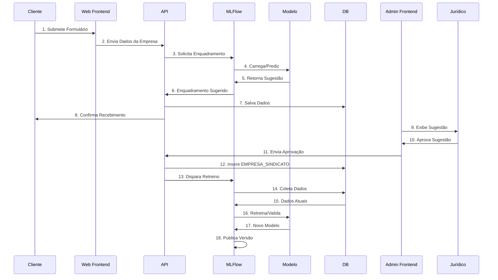
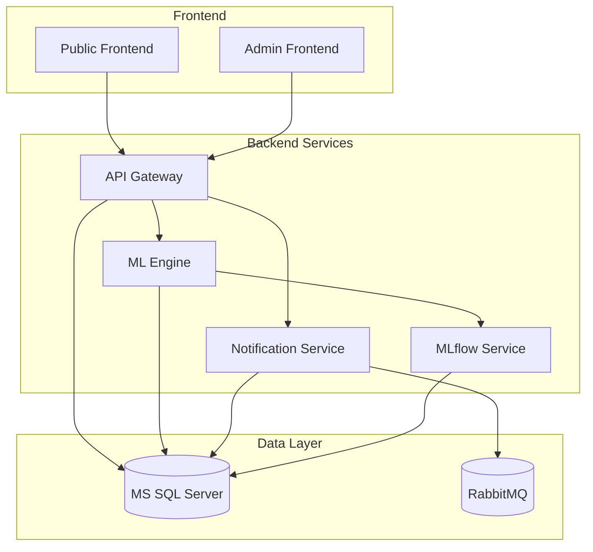
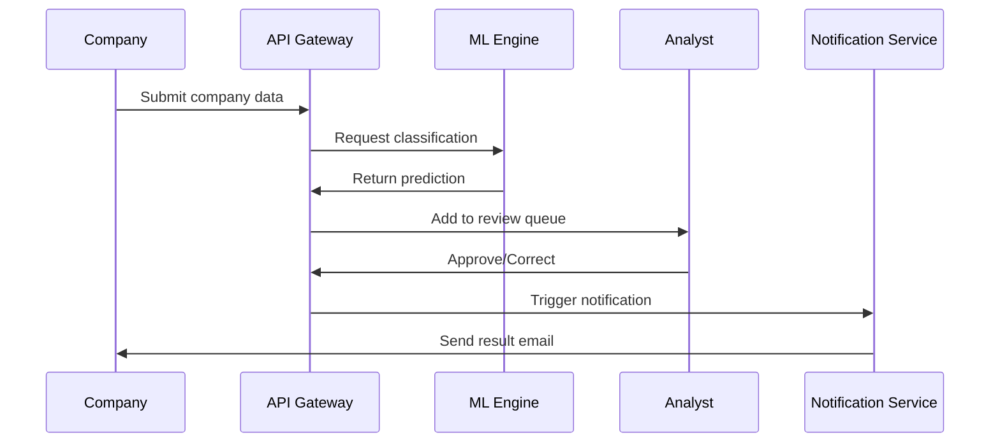

# Union Classification System

**Fix docker socket user access:**

After the instalation of the [Docker >= 19](https://docs.docker.com/engine/install/ubuntu/)
```bash
sudo chmod 666 /var/run/docker.sock
```

## Overview
The Union Classification System is an intelligent platform that automates the process of classifying Brazilian companies with their correct labor unions ("enquadramento sindical") as mandated by the Consolidation of Labor Laws (CLT). The system leverages machine learning to provide fast, accurate classifications while empowering legal analysts to transition from manual processors to expert validators.

## Architecture

### System Flow and Architecture

#### Sequence Diagram


#### Component Architecture


### Classification Flow


## Features
- Company data submission portal
- ML-powered classification prediction
- Admin dashboard for legal analysts
- Notification system
- Comprehensive reporting
- Audit logging
- MLflow integration for model tracking

## Technical Stack
- **Frontend**: React/HTML/CSS/JavaScript
- **Backend**: Node.js (API Gateway, Services)
- **ML Engine**: Python, MLflow
- **Database**: Microsoft SQL Server
- **Message Queue**: RabbitMQ
- **Containerization**: Docker & Docker Compose

## Getting Started

### Prerequisites
- Docker and Docker Compose
- Node.js 18+ (for local development)
- Python 3.12+ (for ML development)
- MS SQL Server Management Studio (optional, for DB management)

### Environment Setup
1. Clone the repository
2. Create a `.env` file in the root directory:
```env
JWT_SECRET=your_secret_here
DB_PASSWORD=YourStrong!Passw0rd
SMTP_HOST=smtp.example.com
SMTP_PORT=587
SMTP_USER=your_user
SMTP_PASS=your_password
RABBITMQ_USER=guest
RABBITMQ_PASS=guest
```

### Running the Application
1. Build and start all services:
```bash
docker-compose up --build
```

2. Initialize the database:
```bash
docker-compose exec db /opt/mssql-tools/bin/sqlcmd -S localhost -U sa -P ${DB_PASSWORD} -i /src/db/init.sql
```

3. Access the applications:
- Public Portal: http://localhost
- Admin Interface: http://localhost/admin
- API Documentation: http://localhost:3000/api-docs
- MLflow UI: http://localhost:5001

## Development Guidelines

### Directory Structure
```
/
├── src/
│   ├── api-gateway/      # Main API Gateway service
│   ├── frontend/         # Web interfaces
│   │   ├── public/      # Company portal
│   │   └── admin/       # Analyst dashboard
│   ├── ml-engine/       # ML prediction service
│   ├── notification-service/
│   ├── reporting-service/
│   └── db/              # Database scripts
├── docs/                # Documentation
└── docker-compose.yml   # Container orchestration
```

### Debugging

#### Frontend
1. Access the React Developer Tools in your browser
2. Source maps are enabled in development mode
3. Check browser console for errors

#### Backend Services
1. API Gateway logs are available via:
```bash
docker-compose logs api-gateway
```

2. Debug Node.js services using VS Code:
   - Use the "Attach to Node Process" configuration
   - Set breakpoints in your code
   - Services run with `--inspect` flag in development

#### ML Engine
1. Access MLflow UI at http://localhost:5001
2. View model metrics, parameters, and artifacts
3. Check training logs:
```bash
docker-compose logs ml-engine
```

#### Database
1. Connect using SQL Server Management Studio:
   - Server: localhost,1433
   - Authentication: SQL Server
   - User: sa
   - Password: (from .env)

2. View table data and run queries
3. Check execution plans for performance tuning

### Running Tests
```bash
# API Gateway tests
docker-compose exec api-gateway npm test

# ML Engine tests
docker-compose exec ml-engine python -m pytest

# Frontend tests
docker-compose exec frontend npm test
```

## Monitoring & Maintenance

### Health Checks
- All services expose /health endpoints
- Monitor service status:
```bash
curl http://localhost:3000/health # API Gateway
curl http://localhost:5000/health # ML Engine
```

### Logs
- Centralized logging with structured JSON format
- View service logs:
```bash
docker-compose logs [service-name]
```

### Performance Monitoring
- API response times in Prometheus format
- ML model inference latency tracking
- Database query performance metrics

## Security Considerations
1. All services use JWT authentication
2. Database credentials stored in environment variables
3. API endpoints protected by role-based access control
4. SQL injection prevention through parameterized queries
5. Regular security updates for dependencies

## Contributing
1. Follow the branching strategy:
   - feature/* for new features
   - bugfix/* for bug fixes
   - hotfix/* for urgent production fixes

2. Submit pull requests with:
   - Clear description of changes
   - Updated tests
   - Documentation updates if needed

## License
This project is proprietary and confidential.

## Support
For technical support, contact the development team or create an issue in the repository.