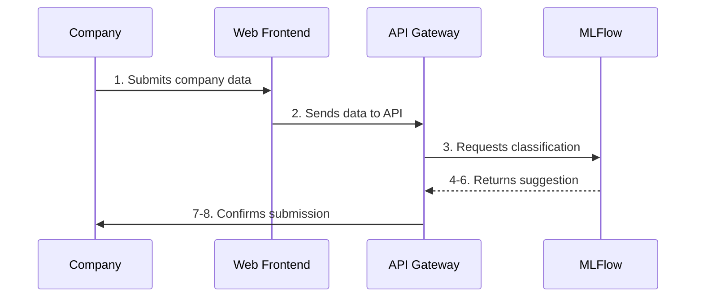

# Product Requirements Document – User Ingestion

## Vision
Enable a streamlined, ML-powered process for company union classification submission and validation.

## Process Flow

## Personas
- **Company Representative:** Needs an intuitive form to request classification.
- **Legal Analyst:** Relies on well-structured submissions to validate results.

## Functional Requirements

### Data Submission (FR-UI-001 to FR-UI-005)
- **Form Fields Required:**
  - Corporate Name
  - CNPJ
  - Primary CNAE
  - Secondary CNAEs (optional)
  - Address with CEP
  - Contact Email

### Data Validation (FR-UI-006 to FR-UI-010)
- Validate CNPJ format and existence
- Validate CNAE codes against official database
- Verify CEP existence and format
- Check for duplicate submissions
- Ensure all mandatory fields are filled

### ML Integration (FR-UI-011 to FR-UI-015)
- Automatic triggering of ML prediction
- Handle ML service timeouts
- Store prediction confidence scores
- Support multiple model versions
- Track prediction metrics

## User Journey
1. Company representative accesses the portal
2. System validates input in real-time as fields are filled
3. On submission:
   - Data validation occurs
   - Duplicate check runs
   - ML prediction is triggered
4. User receives immediate confirmation with tracking ID
5. Email notification sent when classification is ready

## Acceptance Criteria
- Form submission response < 2s
- Real-time field validation
- Clear error messages for invalid data
- Duplicate detection before submission
- Tracking ID provided immediately
- Email notifications working reliably

## Success Metrics
- Form completion rate > 95%
- Input error rate < 2%
- Duplicate submission rate < 1%
- User satisfaction score > 4.5/5
- Average submission time < 3 minutes
- Email delivery success rate > 99%
