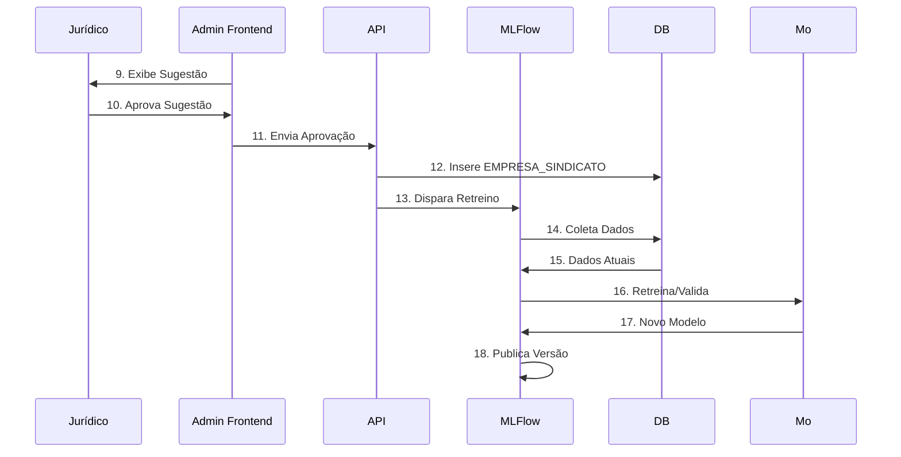

# Product Requirements Document – Admin Interface

## Vision
Empower legal analysts with a centralized dashboard to review, validate, and manage union classifications suggested by the ML model.

## Process Flow

## Personas
- **Legal Analyst:** Senior professional responsible for validating ML suggestions
- **System Administrator:** Manages system access and monitors performance

## Functional Requirements

### Authentication & Authorization (FR-AI-001 to FR-AI-003)
- Secure role-based authentication
- Session management
- Access control by region/jurisdiction

### Dashboard Features (FR-AI-004 to FR-AI-008)
- Pending classifications queue
- ML suggestion confidence scores
- Historical decisions view
- Performance metrics
- Workload distribution

### Classification Management (FR-AI-009 to FR-AI-013)
- One-click approval workflow
- Correction interface with reasoning
- Batch processing capabilities
- Priority queue management
- Automatic notifications

### Model Feedback (FR-AI-014 to FR-AI-016)
- Track approval/rejection rates
- Capture correction patterns
- Trigger model retraining

## User Journey
1. Analyst logs into secure dashboard
2. Reviews queue of pending classifications
3. For each case:
   - Reviews company data
   - Checks ML suggestion and confidence score
   - Approves or corrects classification
4. System:
   - Updates database
   - Triggers notifications
   - Schedules model retraining

## Acceptance Criteria
- Authentication response < 1s
- Dashboard load time < 2s
- Decision processing < 500ms
- 100% audit trail coverage
- Zero data loss on corrections
- Immediate notification triggers

## Success Metrics
- Average decision time < 30s
- Approval rate > 80%
- Analyst satisfaction > 4/5
- System uptime > 99.9%
- Model improvement rate > 5%/month
- Zero security incidents
